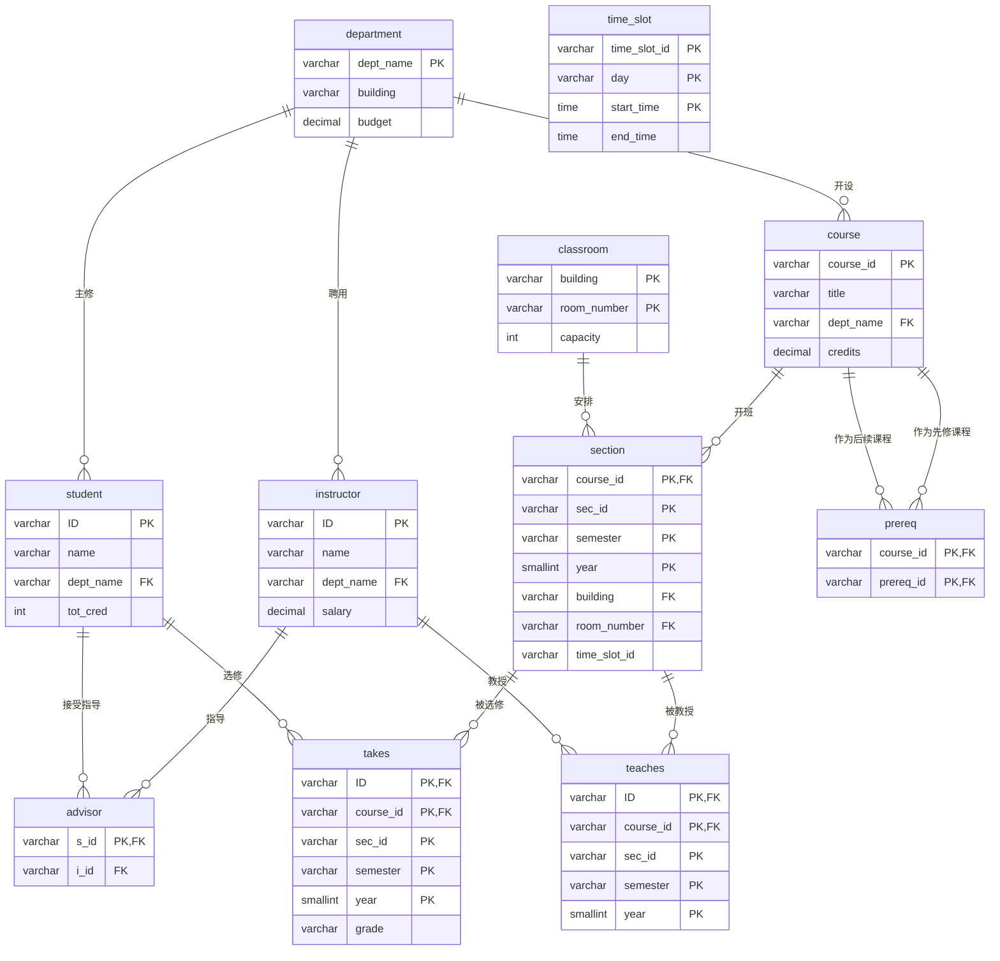
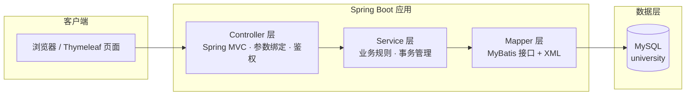
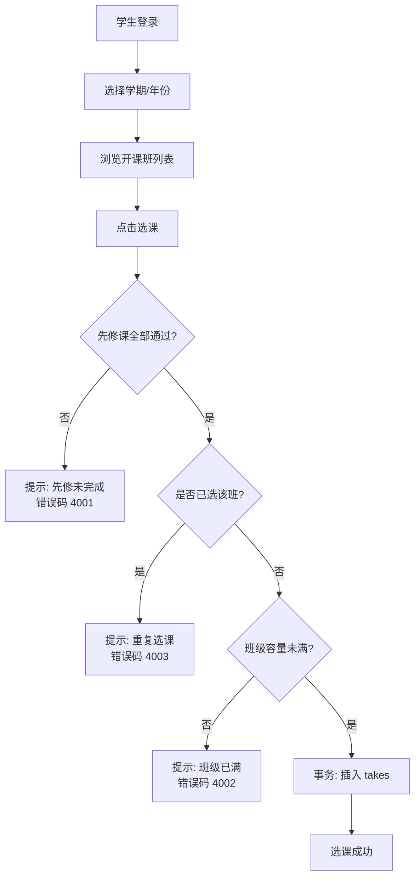
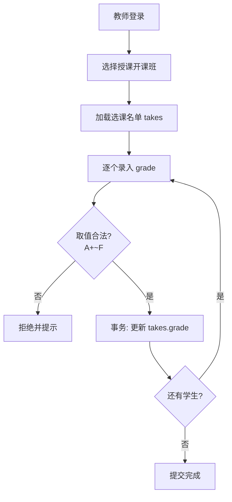

# 大学网站开发文档（University Website Development Document）

> **版本**：v1.0
> **日期**：2026-08-10
> **数据库依据**：`src/main/resources/sql/university.sql`
> **数据库**：MySQL 8 / `university`（utf8mb4）
> **适用场景**：教学演示 / 课程设计；可作为生产系统原型基础

---

## 1. 文档目的与范围

本文档基于项目内 `university.sql` 中定义的数据库模型，设计一个大学教务信息网站（University Website）的完整开发方案，覆盖：

- 数据库现状分析（11 张表结构、ER 图、约束关系）
- 需求分析（角色、功能需求、业务规则、用例）
- 技术架构设计（Spring Boot + Spring MVC + MyBatis 技术栈）
- 功能模块与核心业务流程
- 接口设计（REST API）
- 页面设计
- 关键查询 SQL
- 测试策略与开发计划
- 风险与注意事项

---

## 2. 项目概述

### 2.1 背景与目标

- 以《Database System Concepts》（数据库系统概念）附录 A 的 university 经典模型为数据基础，构建一个 B/S 架构的大学网站。
- 对外：展示系（department）、课程（course）、教师（instructor）、开课班（section）等公开信息。
- 对内：支撑学生选课（takes）、成绩查询、教师成绩录入（teaches）、导师查询（advisor）等教务功能。
- 目标：打通「数据库建模 → 数据访问 → 业务逻辑 → Web 展示」完整链路。

### 2.2 名词术语

| 术语 | 含义 |
| --- | --- |
| department | 系（学院下属教学单位） |
| classroom | 教室（楼 + 房间号联合标识） |
| course | 课程（课程目录，不含学期信息） |
| section | 开课班（课程在某学期的一次开设） |
| instructor | 教师 |
| student | 学生 |
| takes | 选课记录（学生 ↔ 开课班，含成绩） |
| teaches | 授课记录（教师 ↔ 开课班） |
| prereq | 先修关系（课程 ↔ 课程，自关联） |
| advisor | 指导关系（学生 → 教师） |
| time_slot | 上课时间段（如 A 时段：周一/周三 08:00，周五 09:00） |

---

## 3. 数据库设计分析（基于 university.sql）

### 3.1 表清单

| # | 表名 | 类型 | 说明 |
| --- | --- | --- | --- |
| 1 | `department` | 实体 | 系 |
| 2 | `classroom` | 实体 | 教室 |
| 3 | `course` | 实体 | 课程 |
| 4 | `instructor` | 实体 | 教师 |
| 5 | `student` | 实体 | 学生 |
| 6 | `section` | 联系 | 开课班 |
| 7 | `teaches` | 联系 | 授课（教师 ⇋ 开课班，多对多） |
| 8 | `takes` | 联系 | 选课（学生 ⇋ 开课班，多对多，带成绩） |
| 9 | `prereq` | 联系 | 先修课（课程自关联） |
| 10 | `advisor` | 联系 | 指导关系（学生 → 教师，一对一） |
| 11 | `time_slot` | 实体 | 时间段 |

> **说明**：脚本头部注释写「共 9 张表（实体 5 + 联系 4）」，但脚本末尾还创建了 `advisor`、`time_slot` 两张表，实际共 **11 张表**。本文档按实际表数量设计。

### 3.2 ER 图



### 3.3 表结构明细

#### 3.3.1 `department` 系

| 字段 | 类型 | 约束 | 说明 |
| --- | --- | --- | --- |
| `dept_name` | VARCHAR(20) | PK, NOT NULL | 系名称（主键） |
| `building` | VARCHAR(15) | NULL | 所在教学楼 |
| `budget` | DECIMAL(12,2) | NULL | 经费预算 |

#### 3.3.2 `classroom` 教室

| 字段 | 类型 | 约束 | 说明 |
| --- | --- | --- | --- |
| `building` | VARCHAR(15) | PK, NOT NULL | 教学楼 |
| `room_number` | VARCHAR(7) | PK, NOT NULL | 房间号 |
| `capacity` | INT | NULL | 容量 |

> 联合主键 `(building, room_number)`。

#### 3.3.3 `course` 课程

| 字段 | 类型 | 约束 | 说明 |
| --- | --- | --- | --- |
| `course_id` | VARCHAR(8) | PK, NOT NULL | 课程号 |
| `title` | VARCHAR(50) | NULL | 课程名 |
| `dept_name` | VARCHAR(20) | FK → `department.dept_name` | 所属系 |
| `credits` | DECIMAL(2,0) | NULL | 学分 |

#### 3.3.4 `instructor` 教师

| 字段 | 类型 | 约束 | 说明 |
| --- | --- | --- | --- |
| `ID` | VARCHAR(5) | PK, NOT NULL | 教师编号 |
| `name` | VARCHAR(20) | NOT NULL | 姓名 |
| `dept_name` | VARCHAR(20) | FK → `department.dept_name` | 所属系 |
| `salary` | DECIMAL(8,2) | NULL | 工资 |

#### 3.3.5 `student` 学生

| 字段 | 类型 | 约束 | 说明 |
| --- | --- | --- | --- |
| `ID` | VARCHAR(5) | PK, NOT NULL | 学生编号 |
| `name` | VARCHAR(20) | NOT NULL | 姓名 |
| `dept_name` | VARCHAR(20) | FK → `department.dept_name` | 主修系 |
| `tot_cred` | INT | NULL | 已修总学分 |
#### 3.3.6 `section` 开课班

| 字段 | 类型 | 约束 | 说明 |
| --- | --- | --- | --- |
| `course_id` | VARCHAR(8) | PK, FK → `course.course_id` | 课程号 |
| `sec_id` | VARCHAR(8) | PK, NOT NULL | 开课号 |
| `semester` | VARCHAR(6) | PK, NOT NULL | 学期（Fall/Spring/Summer） |
| `year` | SMALLINT | PK, NOT NULL | 年份 |
| `building` | VARCHAR(15) | FK（复合，与 room_number 一起）→ `classroom` | 教学楼 |
| `room_number` | VARCHAR(7) | FK（复合）→ `classroom` | 房间号 |
| `time_slot_id` | VARCHAR(4) | NULL | 时间段标识（逻辑引用 `time_slot`，无外键） |

> 联合主键 `(course_id, sec_id, semester, year)`；复合外键 `(building, room_number)` → `classroom(building, room_number)`。

#### 3.3.7 `teaches` 授课

| 字段 | 类型 | 约束 | 说明 |
| --- | --- | --- | --- |
| `ID` | VARCHAR(5) | PK, FK → `instructor.ID` | 教师编号 |
| `course_id` | VARCHAR(8) | PK, FK（复合）→ `section` | 课程号 |
| `sec_id` | VARCHAR(8) | PK | 开课号 |
| `semester` | VARCHAR(6) | PK | 学期 |
| `year` | SMALLINT | PK | 年份 |

> 联合主键 `(ID, course_id, sec_id, semester, year)`；复合外键 `(course_id, sec_id, semester, year)` → `section`。

#### 3.3.8 `takes` 选课

| 字段 | 类型 | 约束 | 说明 |
| --- | --- | --- | --- |
| `ID` | VARCHAR(5) | PK, FK → `student.ID` | 学生编号 |
| `course_id` | VARCHAR(8) | PK, FK（复合）→ `section` | 课程号 |
| `sec_id` | VARCHAR(8) | PK | 开课号 |
| `semester` | VARCHAR(6) | PK | 学期 |
| `year` | SMALLINT | PK | 年份 |
| `grade` | VARCHAR(2) | NULL | 成绩（A+/A-/B/...） |

> 联合主键 `(ID, course_id, sec_id, semester, year)` 天然防止同一学生重复选同一班。

#### 3.3.9 `prereq` 先修课

| 字段 | 类型 | 约束 | 说明 |
| --- | --- | --- | --- |
| `course_id` | VARCHAR(8) | PK, FK → `course.course_id` | 课程号（需要先修的课） |
| `prereq_id` | VARCHAR(8) | PK, FK → `course.course_id` | 先修课程号 |

> 联合主键 `(course_id, prereq_id)`；自引用外键。示例：`CS-347 → CS-101`。

#### 3.3.10 `advisor` 指导关系

| 字段 | 类型 | 约束 | 说明 |
| --- | --- | --- | --- |
| `s_id` | VARCHAR(5) | PK, FK → `student.ID` | 学生编号 |
| `i_id` | VARCHAR(5) | NULL, FK → `instructor.ID` | 指导教师编号 |

> `s_id` 为主键 → 一个学生最多一位导师（一对一）。

#### 3.3.11 `time_slot` 时间段

| 字段 | 类型 | 约束 | 说明 |
| --- | --- | --- | --- |
| `time_slot_id` | VARCHAR(4) | PK, NOT NULL | 时间段标识 |
| `day` | VARCHAR(1) | PK, NOT NULL | 星期（M/W/F） |
| `start_time` | TIME | PK, NOT NULL | 开始时间 |
| `end_time` | TIME | NULL | 结束时间 |

> 联合主键 `(time_slot_id, day, start_time)`。示例：`('A','M','08:00:00','08:50:00')` 表示 A 时段周一 08:00–08:50。

### 3.4 外键与引用关系汇总（共 13 个外键）

| 外键 | 来源表 | 引用目标 |
| --- | --- | --- |
| `fk_course_department` | `course.dept_name` | `department.dept_name` |
| `fk_instructor_department` | `instructor.dept_name` | `department.dept_name` |
| `fk_student_department` | `student.dept_name` | `department.dept_name` |
| `fk_section_course` | `section.course_id` | `course.course_id` |
| `fk_section_classroom` | `section(building, room_number)` | `classroom(building, room_number)` |
| `fk_teaches_instructor` | `teaches.ID` | `instructor.ID` |
| `fk_teaches_section` | `teaches(course_id, sec_id, semester, year)` | `section(...)` |
| `fk_takes_student` | `takes.ID` | `student.ID` |
| `fk_takes_section` | `takes(course_id, sec_id, semester, year)` | `section(...)` |
| `fk_prereq_course` | `prereq.course_id` | `course.course_id` |
| `fk_prereq_course_prereq` | `prereq.prereq_id` | `course.course_id` |
| `fk_advisor_student` | `advisor.s_id` | `student.ID` |
| `fk_advisor_instructor` | `advisor.i_id` | `instructor.ID` |

### 3.5 示例数据规模

| 表 | 行数 | 表 | 行数 |
| --- | --- | --- | --- |
| `department` | 7 | `section` | 15 |
| `classroom` | 5 | `teaches` | 15 |
| `course` | 13 | `takes` | 23 |
| `instructor` | 12 | `prereq` | 6 |
| `student` | 13 | `advisor` | 10 |
| | | `time_slot` | 18 |

### 3.6 约束与注意点

- **枚举取值无 CHECK 约束**：`semester`（Fall/Spring/Summer）、`grade`（A+/A/A-/B+/B/B-/C+/C/C-/D/F）需在应用层校验，必要时加触发器兜底。
- **`section.time_slot_id` 无外键**：仅为逻辑引用 `time_slot`，需在应用层保证存在性，防止脏数据。
- **先修关系可能成环**：`prereq` 自引用无环检测，选课校验需用递归查询或应用层 DFS。
- **`advisor.s_id` 为主键**：学生与导师为一对一关系；示例中 10 名学生已分配导师。
- **ID 为文本主键**：`student.ID`、`instructor.ID` 为 VARCHAR(5)，示例值为数字字符串，展示时注意补零。
- **脚本破坏性**：`university.sql` 开头 `DROP DATABASE IF EXISTS university`，重复执行会清空数据。
---

## 4. 需求分析

### 4.1 角色定义

| 角色 | 说明 | 主要功能 |
| --- | --- | --- |
| 访客（Visitor） | 未登录用户 | 浏览系、课程、教师、开课班信息 |
| 学生（Student） | `student` 表中的学生 | 查看个人信息、选课/退课、成绩单、导师 |
| 教师（Instructor） | `instructor` 表中的教师 | 查看授课任务、班级名单、录入/修改成绩 |
| 教务管理员（Admin） | 系统维护者 | 维护系/课程/教室/开课班等基础数据、统计报表 |

### 4.2 功能需求清单

| 编号 | 功能 | 说明 | 角色 |
| --- | --- | --- | --- |
| FR-01 | 系管理 | 系列表、系详情（教师数/课程数/预算）、增删改 | 访客 / 管理员 |
| FR-02 | 课程管理 | 按系/关键字筛选、课程详情（含先修课）、增删改 | 访客 / 管理员 |
| FR-03 | 教师管理 | 教师列表、详情（含授课班次）、增删改 | 访客 / 管理员 |
| FR-04 | 学生管理 | 学生列表、详情（含成绩/导师）、增删改 | 管理员 |
| FR-05 | 开课班管理 | 按学期/课程查询开课班、排课（教室 + 时间段） | 访客 / 管理员 |
| FR-06 | 选课/退课 | 学生选课（校验先修、容量、重复）、退课 | 学生 |
| FR-07 | 成绩管理 | 教师录入/修改成绩、学生查询成绩单 | 教师 / 学生 |
| FR-08 | 导师管理 | 学生查询导师、系内导师分配 | 学生 / 管理员 |
| FR-09 | 统计报表 | 系预算、教师平均工资、选课人数、成绩分布 | 管理员 |
| FR-10 | 账号登录 | 登录/登出、角色鉴权（需扩展账号表，见附录） | 全部 |

### 4.3 核心业务规则

| 编号 | 规则 |
| --- | --- |
| BR-01 | `semester` 仅允许 Fall / Spring / Summer |
| BR-02 | 选课前校验该课程全部先修课已通过（`takes.grade` 非 NULL 且非 'F'） |
| BR-03 | 同一学生同一开课班不可重复选课（联合主键保证，需友好提示） |
| BR-04 | 开课班选课人数不得超过 `classroom.capacity` |
| BR-05 | `grade` 取值集合：A+, A, A-, B+, B, B-, C+, C, C-, D, F |
| BR-06 | 学生 `tot_cred` 随成绩单累计（按已通过课程学分累加，可按需定时重算） |
| BR-07 | 先修关系禁止成环（新增先修课时校验） |
| BR-08 | 退课后该班成绩记录必须删除；录入成绩时该生必须在选课名单中 |

### 4.4 用例清单

| 编号 | 用例 | 角色 | 说明 |
| --- | --- | --- | --- |
| UC-01 | 浏览课程目录 | 访客 | 按系/关键字检索课程 |
| UC-02 | 查看课程先修关系 | 访客 | 课程详情页展示先修链 |
| UC-03 | 学生选课 | 学生 | 从开课班列表选择并校验 |
| UC-04 | 查看成绩单 | 学生 | 展示全部 takes 记录与 GPA 汇总 |
| UC-05 | 查看授课任务 | 教师 | 列出所教开课班 |
| UC-06 | 录入成绩 | 教师 | 对名单中学生录入 grade |
| UC-07 | 排课 | 管理员 | 创建/修改 section，分配教室与时间段 |
| UC-08 | 维护基础数据 | 管理员 | 系/课程/教师/学生/教室 CRUD |
| UC-09 | 统计报表 | 管理员 | 工资、选课人数、成绩分布等统计 |
---

## 5. 技术架构设计

### 5.1 技术选型

技术栈确定为 **Spring Boot + Spring MVC + MyBatis**：

| 层次 | 技术 | 版本 / 说明 |
| --- | --- | --- |
| 语言 | Java | 8（现有工程 source/target=1.8，因此 Spring Boot 选 2.7.x） |
| 构建 | Maven | 现有 `pom.xml` |
| 数据库 | MySQL | 8.x，`utf8mb4` |
| 核心框架 | Spring Boot | 2.7.x（3.x 要求 Java 17+，本项目不适用） |
| Web 框架 | Spring MVC | `spring-boot-starter-web` 内置 |
| ORM | MyBatis | `mybatis-spring-boot-starter` 2.3.x（与 Boot 2.7 配套） |
| JDBC 驱动 | `mysql-connector-j` | 8.0.33（已引入，版本由 Boot 依赖管理统一） |
| 模板引擎 | Thymeleaf | `spring-boot-starter-thymeleaf`（服务端渲染页面） |
| 测试 | Spring Boot Test + JUnit 5 | `spring-boot-starter-test` |

**pom.xml 需新增依赖**：

```xml
<dependency>
    <groupId>org.springframework.boot</groupId>
    <artifactId>spring-boot-starter-web</artifactId>
    <version>2.7.18</version>
</dependency>
<dependency>
    <groupId>org.mybatis.spring.boot</groupId>
    <artifactId>mybatis-spring-boot-starter</artifactId>
    <version>2.3.2</version>
</dependency>
<dependency>
    <groupId>org.springframework.boot</groupId>
    <artifactId>spring-boot-starter-thymeleaf</artifactId>
    <version>2.7.18</version>
</dependency>
<dependency>
    <groupId>org.springframework.boot</groupId>
    <artifactId>spring-boot-starter-test</artifactId>
    <version>2.7.18</version>
    <scope>test</scope>
</dependency>
```

> 现有裸 `mybatis` 3.5.19 依赖可移除，由 `mybatis-spring-boot-starter` 统一管理；`mysql-connector-j` 保留。

### 5.2 分层架构



职责划分：

- **Controller**：`@Controller` / `@RestController`，接收请求、参数校验、调用 Service、返回 Thymeleaf 视图或 JSON。
- **Service**：承载业务规则（BR-01 ~ BR-08），`@Transactional` 管理事务边界。
- **Mapper**：接口 + `resources/mapper/*.xml`，只做数据访问。
- **Entity**：与 11 张表一一对应的 POJO。

### 5.3 推荐目录结构（已并入 algs4 根工程，位于 `src/main/java/com/ds/university/`）

```
src/main/java/com/ds/university/
├── UniversityApplication.java   # 启动类：@SpringBootApplication + @MapperScan("com.ds.university.mapper")
├── config/                      # WebMvcConfig / 登录拦截器 / 其他配置
├── controller/                  # DepartmentController / CourseController / SectionController /
│                                #   StudentController / InstructorController / AdminController
├── service/                     # CourseService / EnrollmentService / GradeService /
│                                #   StatsService / AdminService
├── mapper/                      # 11 个 Mapper 接口
├── entity/                      # 11 个 POJO
└── common/                      # Result 统一返回 / 错误码 / 全局异常处理（@RestControllerAdvice）

src/main/resources/
├── sql/university.sql           # 数据库脚本（现有）
├── mapper/*.xml                 # MyBatis Mapper XML
├── application.yml              # 数据源、MyBatis、Thymeleaf 配置
├── db.properties                # 现有连接配置（供建库工具 UniversityDbSetup 使用）
├── mybatis-config.xml           # 现有配置（可保留；运行期由 application.yml 接管）
└── templates/                   # Thymeleaf 页面：index.html / courses.html / ...
```

### 5.4 关键配置示例（application.yml）

```yaml
spring:
  datasource:
    driver-class-name: com.mysql.cj.jdbc.Driver
    url: jdbc:mysql://localhost:3306/university?useUnicode=true&characterEncoding=UTF-8&serverTimezone=Asia/Shanghai&useSSL=false&allowPublicKeyRetrieval=true
    username: root
    password: root
  thymeleaf:
    cache: false

mybatis:
  mapper-locations: classpath:mapper/*.xml
  type-aliases-package: com.ds.university.entity
  configuration:
    map-underscore-to-camel-case: true
```

> 账号密码建议从 `db.properties` 或环境变量读取，避免硬编码。

### 5.5 现有工程可复用点

| 现有资源 | 用途 |
| --- | --- |
| `com.ds.db.UniversityDbSetup` | 一键建库 + 插入示例数据（运行 `main` 即可） |
| `src/main/resources/sql/university.sql` | 建库脚本（11 张表 + 示例数据） |
| `src/main/resources/db.properties` | 建库工具连接配置（user/password/port） |
| `com.ds.huffman.db.*` 的 Mapper 接口 + XML 写法 | 作为 entity/mapper 编码范式 |
| `pom.xml` 中的 `mysql-connector-j` / JUnit 依赖 | 直接复用；MyBatis 由 starter 统一管理 |

### 5.6 参数校验（Bean Validation 统一拦截）

service 层参数校验已从手工 if 判断统一迁移到 Bean Validation（Hibernate Validator，javax.validation），机制如下：

| 组件 | 位置 | 职责 |
| --- | --- | --- |
| `@Validated` + 参数约束注解 | service 方法签名 | 声明式校验（`@NotBlank`/`@NotNull`/`@Min`/`@Size`/`@Pattern`/`@DecimalMin` 等），消息文案与原手工校验一致 |
| `ValidationConfig` | `config` | 自定义 `MethodValidationPostProcessor`（最低优先级，校验位于 advice 链最内层），占据 Boot 自动配置位置 |
| `ValidationExceptionAspect` | `config` | 最高优先级切面，拦截 service 包，将 `ConstraintViolationException` 转译为 `BusinessException(PARAM_ERROR)`；多条违反去重后用「；」拼接 |
| `GlobalExceptionHandler` | `common` | 兜底处理漏网的 `ConstraintViolationException`，渲染 error 页 |

约定：

- 仅格式类参数校验（非空、长度、取值范围）用注解；依赖数据库的业务校验（院系/课程/教室存在性、排课冲突、容量、先修成环）及非 PARAM_ERROR 错误码的校验（登录、密码强度、成绩取值）仍保留手工实现。
- `Section` 实体主键字段带约束注解，配合 `@Valid` 在 `createSection`/`updateSection` 级联校验；`building`/`roomNumber`/`timeSlotId` 不加注解（未排课创建场景允许为空）。
- controller 无需改动，沿用现有 `catch (BusinessException)` → flash 错误提示 / `Result.error` 流程。
- 新增 service 参数校验时优先在方法签名加约束注解，不要新写手工 if 判断。

## 6. 功能模块与核心流程

### 6.1 模块划分

| 模块 | 编号 | 内容 |
| --- | --- | --- |
| 公共模块 | M1 | 首页、统一布局、导航、登录 |
| 浏览查询模块 | M2 | 系/课程/教师/开课班浏览与检索（FR-01~03, FR-05） |
| 学生中心 | M3 | 选课、退课、成绩单、导师（FR-06~08） |
| 教师中心 | M4 | 授课列表、班级名单、成绩录入（FR-07） |
| 教务管理 | M5 | 基础数据维护、排课（FR-01~05） |
| 统计报表 | M6 | 工资、选课人数、成绩分布（FR-09） |

### 6.2 学生选课流程



### 6.3 教师成绩录入流程


---

## 7. 接口设计（REST API）

统一响应格式（JSON）：

```json
{ "code": 0, "message": "success", "data": { } }
```

错误码约定：

| 错误码 | 含义 |
| --- | --- |
| 4000 | 参数错误 |
| 4001 | 先修课程未完成 |
| 4002 | 开课班容量已满 |
| 4003 | 重复选课 |
| 4004 | 成绩取值非法 / 学生不在名单 |
| 4005 | 先修关系成环 |
| 4010 | 未登录 / 无权限 |
| 4040 | 资源不存在 |

### 7.1 浏览查询接口

| 方法 | 路径 | 说明 | 角色 |
| --- | --- | --- | --- |
| GET | `/api/departments` | 系列表（含教师数、课程数） | 访客 |
| GET | `/api/departments/{deptName}` | 系详情 | 访客 |
| GET | `/api/courses?deptName=&keyword=` | 课程列表（按系/关键字筛选） | 访客 |
| GET | `/api/courses/{courseId}` | 课程详情 | 访客 |
| GET | `/api/courses/{courseId}/prereqs` | 先修课列表（递归） | 访客 |
| GET | `/api/instructors?deptName=` | 教师列表 | 访客 |
| GET | `/api/instructors/{id}` | 教师详情 | 访客 |
| GET | `/api/instructors/{id}/sections` | 教师授课列表 | 访客 / 教师 |
| GET | `/api/sections?semester=&year=&courseId=` | 开课班列表（含教师、教室、已选人数） | 访客 |
| GET | `/api/sections/{courseId}/{secId}/{semester}/{year}` | 开课班详情 | 访客 |
| GET | `/api/classrooms` | 教室列表 | 管理员 |

### 7.2 学生相关接口

| 方法 | 路径 | 说明 | 角色 |
| --- | --- | --- | --- |
| GET | `/api/students/{id}` | 学生基本信息 | 本人 / 管理员 |
| GET | `/api/students/{id}/transcript` | 成绩单（含课程、学分、GPA） | 本人 / 管理员 |
| GET | `/api/students/{id}/advisor` | 导师信息 | 本人 / 管理员 |
| POST | `/api/takes` | 选课（body: 学生ID + 开课班主键） | 学生 |
| DELETE | `/api/takes` | 退课 | 学生 |

### 7.3 教师相关接口

| 方法 | 路径 | 说明 | 角色 |
| --- | --- | --- | --- |
| GET | `/api/sections/{courseId}/{secId}/{semester}/{year}/students` | 班级名单 | 授课教师 |
| PUT | `/api/takes/grade` | 录入/修改成绩 | 授课教师 |

### 7.4 管理接口

| 方法 | 路径 | 说明 | 角色 |
| --- | --- | --- | --- |
| POST/PUT/DELETE | `/api/departments` | 系增改删 | 管理员 |
| POST/PUT/DELETE | `/api/courses` | 课程增改删 | 管理员 |
| POST/PUT/DELETE | `/api/instructors` | 教师增改删 | 管理员 |
| POST/PUT/DELETE | `/api/students` | 学生增改删 | 管理员 |
| POST/PUT/DELETE | `/api/sections` | 开课班/排课增改删 | 管理员 |
| POST/PUT/DELETE | `/api/classrooms` | 教室增改删 | 管理员 |
| POST/DELETE | `/api/prereqs` | 先修关系维护（含环检测） | 管理员 |

### 7.5 统计接口

| 方法 | 路径 | 说明 | 角色 |
| --- | --- | --- | --- |
| GET | `/api/stats/budget-by-dept` | 系经费与教师数 | 管理员 |
| GET | `/api/stats/salary-by-dept` | 各系教师平均工资 | 管理员 |
| GET | `/api/stats/enrollment` | 各开课班选课人数 vs 容量 | 管理员 |
| GET | `/api/stats/grade-distribution?courseId=` | 某课程成绩分布 | 管理员 / 教师 |
---

## 8. 页面设计

采用 Thymeleaf 服务端渲染（Spring Boot 方案），页面路径即 Controller 路由：

| 页面 | 路由 / 模板 | 说明 |
| --- | --- | --- |
| 首页 | `/` → `templates/index.html` | 导航入口 + 系/课程/教师统计卡片 |
| 系列表 | `/departments` → `departments.html` | 表格展示系名、楼、预算、课程数、教师数 |
| 系详情 | `/departments/{deptName}` → `department.html` | 该系教师列表 + 课程列表 |
| 课程列表 | `/courses` → `courses.html` | 按系、关键字筛选，分页 |
| 课程详情 | `/courses/{courseId}` → `course.html` | 基本信息 + 先修课链 + 历年开课班 |
| 开课班列表 | `/sections` → `sections.html` | 按学期/年份/课程筛选，显示教室、教师、余量 |
| 教师列表 | `/instructors` → `instructors.html` | 按系筛选 |
| 教师详情 | `/instructors/{id}` → `instructor.html` | 教师信息 + 授课班次 |
| 登录页 | `/login` → `login.html` | 学生/教师/管理员登录（扩展账号表后） |
| 学生主页 | `/student/home` → `student/home.html` | 个人信息 + 导师 + 快捷入口 |
| 选课页 | `/student/enroll` → `student/enroll.html` | 可选开课班列表 + 选课操作 |
| 成绩单 | `/student/transcript` → `student/transcript.html` | 成绩表格 + 学分/GPA 汇总 |
| 教师主页 | `/instructor/home` → `instructor/home.html` | 授课班次列表 |
| 成绩录入 | `/instructor/grade` → `instructor/grade.html` | 名单 + 成绩下拉 + 保存 |
| 教务后台 | `/admin/*` → `admin/*.html` | 各基础数据维护页面 + 统计图表 |

UI 设计要点：

- 统一布局：Thymeleaf 模板片段（fragment）复用顶部导航、页脚，按角色渲染菜单。
- 表格展示为主，支持筛选与分页；关键数值（预算、工资、容量）右对齐。
- 选课/成绩操作使用表单 + 错误码提示；统计页可选 ECharts 图表。
- 权限控制：Spring MVC 拦截器 + 注解鉴权，接口层二次校验。
## 9. 关键查询设计（示例 SQL）

以下 SQL 直接对应核心功能的实现，也作为 Mapper XML 中语句的基准。

**Q1 学生成绩单（含课程与学分）**

```sql
SELECT t.course_id, c.title, c.credits, t.semester, t.year, t.grade
FROM takes t
JOIN course c ON t.course_id = c.course_id
WHERE t.ID = '12345'
ORDER BY t.year, t.semester;
```

**Q2 某学期开课班及其授课教师**

```sql
SELECT s.course_id, s.sec_id, s.semester, s.year,
       s.building, s.room_number, cl.capacity,
       i.ID AS instructor_id, i.name AS instructor_name
FROM section s
LEFT JOIN classroom cl
       ON s.building = cl.building AND s.room_number = cl.room_number
LEFT JOIN teaches t
       ON s.course_id = t.course_id AND s.sec_id = t.sec_id
      AND s.semester = t.semester AND s.year = t.year
LEFT JOIN instructor i ON t.ID = i.ID
WHERE s.course_id = 'CS-101' AND s.semester = 'Spring' AND s.year = 2010;
```

**Q3 各系教师平均工资**

```sql
SELECT dept_name, COUNT(*) AS teacher_cnt, AVG(salary) AS avg_salary
FROM instructor
GROUP BY dept_name
ORDER BY avg_salary DESC;
```

**Q4 课程先修链（递归，MySQL 8）**

```sql
WITH RECURSIVE prereq_chain AS (
    SELECT course_id, prereq_id, 1 AS depth
    FROM prereq WHERE course_id = 'CS-347'
    UNION ALL
    SELECT p.course_id, p.prereq_id, c.depth + 1
    FROM prereq p
    JOIN prereq_chain c ON c.prereq_id = p.course_id
)
SELECT * FROM prereq_chain ORDER BY depth;
```
**Q5 选课人数与教室容量对比（余量）**

```sql
SELECT s.course_id, s.sec_id, s.semester, s.year,
       COUNT(t.ID) AS enrolled, cl.capacity,
       cl.capacity - COUNT(t.ID) AS remaining
FROM section s
JOIN classroom cl
     ON s.building = cl.building AND s.room_number = cl.room_number
LEFT JOIN takes t
     ON s.course_id = t.course_id AND s.sec_id = t.sec_id
    AND s.semester = t.semester AND s.year = t.year
GROUP BY s.course_id, s.sec_id, s.semester, s.year, cl.capacity
HAVING COUNT(t.ID) >= cl.capacity;   -- 去掉 HAVING 即为全量余量
```

**Q6 教师授课清单**

```sql
SELECT c.course_id, c.title, s.sec_id, s.semester, s.year
FROM teaches t
JOIN course c ON t.course_id = c.course_id
JOIN section s
     ON t.course_id = s.course_id AND t.sec_id = s.sec_id
    AND t.semester = s.semester AND t.year = s.year
WHERE t.ID = '10101'
ORDER BY s.year, s.semester;
```

**Q7 学生已通过课程（选课先修校验用）**

```sql
SELECT course_id, grade
FROM takes
WHERE ID = '12345'
  AND grade IS NOT NULL
  AND grade <> 'F';
```

**Q8 学生导师**

```sql
SELECT s.ID AS student_id, s.name AS student_name,
       i.ID AS advisor_id, i.name AS advisor_name, d.dept_name
FROM advisor a
JOIN student s ON a.s_id = s.ID
JOIN instructor i ON a.i_id = i.ID
JOIN department d ON i.dept_name = d.dept_name
WHERE s.ID = '12345';
```

**Q9 成绩分布**

```sql
SELECT grade, COUNT(*) AS cnt
FROM takes
WHERE course_id = 'CS-101' AND sec_id = '1'
  AND semester = 'Fall' AND year = 2009
GROUP BY grade
ORDER BY cnt DESC;
```

---

## 10. 测试策略

- **单元测试**：JUnit 5（`pom.xml` 已引入），聚焦 Service 层业务规则（先修校验、容量校验、重复选课、成绩取值、环检测）。
- **集成测试**：真实 MySQL + MyBatis，验证 Mapper SQL 与实体映射；可直接基于 `university.sql` 示例数据。
- **边界场景用例**：

| 用例 | 输入 | 期望结果 |
| --- | --- | --- |
| 正常选课 | 满足先修、容量充足 | 插入 `takes` 成功 |
| 先修未完成 | 学生未通过 `CS-101`，选 `CS-347` | 拒绝，错误码 4001 |
| 班级已满 | 选课人数 ≥ 容量 | 拒绝，错误码 4002 |
| 重复选课 | 同一学生选同一班两次 | 拒绝，错误码 4003 |
| 成绩取值非法 | 录入 'Z' | 拒绝，错误码 4004 |
| 先修成环 | 新增 `A→B` 且已存在 `B→A` | 拒绝，错误码 4005 |

- **性能与并发**：选课并发场景可对 `section` 行加锁（`SELECT ... FOR UPDATE`）或使用唯一键冲突捕获保证一致性。
- **验收方式**：跑通全部用例 + 关键页面手工冒烟。
---

## 11. 开发计划（里程碑）

| 里程碑 | 内容 | 预估工作量 |
| --- | --- | --- |
| M0 环境与建库 | 运行 `UniversityDbSetup` 建库；`mybatis-config.xml` 切换数据库为 `university` | 0.5 周 |
| M1 数据访问层 | 11 个 entity + Mapper 接口/XML，基础 CRUD + 集成测试 | 1 周 |
| M2 浏览功能 | 系/课程/教师/开课班查询与详情页（UC-01/02） | 1 周 |
| M3 学生中心 | 登录、选课/退课、成绩单、导师（UC-03/04） | 1.5 周 |
| M4 教师中心 | 授课列表、班级名单、成绩录入（UC-05/06） | 1 周 |
| M5 教务管理 | 基础数据维护、排课、先修管理（UC-07/08） | 1 周 |
| M6 统计与收尾 | 统计报表（UC-09）、集成测试、缺陷修复、部署说明 | 0.5 周 |

> 总计约 6.5 周（单人全职）；若并行分工可按模块拆分。

---

## 12. 风险与注意事项

| 风险/注意点 | 说明与对策 |
| --- | --- |
| 脚本破坏性重建 | `university.sql` 开头 `DROP DATABASE IF EXISTS university`；开发期可接受，生产需改造为增量迁移脚本 |
| Spring Boot 数据源配置 | 新建 `application.yml` 数据源指向 `university`，与现有指向 `huffman_demo` 的 `mybatis-config.xml` 隔离，避免相互影响 |
| Boot 与 Java 版本匹配 | 本项目为 Java 8，必须使用 Spring Boot 2.7.x（3.x 需 Java 17+），避免升级导致编译失败 |
| 缺少 CHECK 约束 | `semester`、`grade` 等枚举取值在应用层强校验，可加触发器兜底 |
| `time_slot_id` 无外键 | 排课时校验时间段存在性，避免引用不存在的时间段 |
| 先修关系成环 | 新增/修改 `prereq` 时做环检测（递归 CTE 或应用层 DFS） |
| 文本主键 | `student.ID` / `instructor.ID` 为 VARCHAR(5)，前端展示注意补零；后续可平滑迁移为数字自增 |
| 无账号体系 | 原模型不含登录信息，需扩展 `sys_user` 表（见附录） |
| 选课并发 | 容量校验与插入需在同一事务并加行锁，防止超选 |

---

## 13. 附录

### 13.1 账号与权限表（已实现）

原 university 模型不含账号/密码/角色，已通过独立脚本 `src/main/resources/sql/university_auth.sql` 扩展（不改动原 11 张业务表），采用 RBAC 模型，共 5 张表：

| 表名 | 说明 |
| --- | --- |
| `sys_user` | 账号表：`user_id` 主键、BCrypt 密码、`user_type`（STUDENT/INSTRUCTOR/ADMIN）、`ref_id` 关联 `student.ID` / `instructor.ID`、`avatar` 头像文件名（V5 迁移新增，存于 uploads 目录） |
| `sys_role` | 角色表：STUDENT / INSTRUCTOR / ADMIN |
| `sys_permission` | 权限表：细粒度权限点（如 `course:manage`、`take:grade`） |
| `sys_user_role` | 用户-角色关联（多对多） |
| `sys_role_permission` | 角色-权限关联（多对多） |

关键设计：

- `user_type` + `ref_id` 把账号关联到业务表：STUDENT → `student.ID`，INSTRUCTOR → `instructor.ID`，ADMIN 的 `ref_id` 为 NULL。
- 密码只存 BCrypt 哈希；脚本内置 3 个演示账号（`zhang` 学生 / `katz` 教师 / `admin` 管理员），默认密码 `password`，上线前必须重置。
- 权限点采用「资源:操作」编码（如 `course:view` / `course:manage`），角色-权限映射在脚本中预置，管理员默认拥有全部权限。
- 头像功能（学生/教师均可）：`/account/avatar` 页面上传（JPG/PNG/GIF/WebP，≤5MB），文件以 UUID 命名落盘到 `app.upload.avatar-dir`（默认 `./uploads/avatars`），`sys_user.avatar` 仅存文件名，经 `/uploads/avatars/{文件名}` 访问；导航栏展示当前头像，替换/移除操作记入审计日志（AVATAR_UPDATE / AVATAR_REMOVE）。
- 系统公告（V6 迁移新增 `sys_announcement`，V7 增强）：管理员在 `/admin/announcements` 发布/编辑/下线/删除公告，支持**类型分类**（通知/新闻动态/活动/其他）、**置顶**、**定时发布**（发布时间晚于当前时间则到时自动对外可见）、**到期自动下线**（到期后对外实时不可见）；首页"系统公告"面板、公开列表页 `/announcements`（可按类型筛选）与详情页 `/announcements/{id}` 展示已发布且有效期内公告；公告增删改均记入审计日志（对象类型 ANNOUNCEMENT）。
- 执行方式：先运行 `university.sql` 建业务库，再运行 `university_auth.sql` 建权限模型。
### 13.2 建库与初始化步骤

1. 确保 MySQL 8 运行，且 `src/main/resources/db.properties` 中 `user/password/port` 正确。
2. 依次执行 `university.sql`（业务表 + 示例数据）与 `university_auth.sql`（账号与权限表）；也可运行 `com.ds.db.UniversityDbSetup` 的 `main` 方法一键完成建库 + 结构验证（工具会依次执行两个脚本）。
3. 在 Spring Boot 工程的 `application.yml` 中配置数据源指向 `university`（账号可复用 `db.properties`）。
4. 启动应用：`mvn spring-boot:run`（或 IDE 运行 `UniversityApplication`），浏览器访问 `http://localhost:8080/`。
5. 打包部署、演示账号与常见问题详见 [部署说明](部署说明.md)。
### 13.3 关键实体字段速查（entity 设计对照）

| entity | 主键字段 | 外键字段 |
| --- | --- | --- |
| `Department` | `deptName` | — |
| `Classroom` | `building` + `roomNumber` | — |
| `Course` | `courseId` | `deptName` |
| `Instructor` | `id` | `deptName` |
| `Student` | `id` | `deptName` |
| `Section` | `courseId` + `secId` + `semester` + `year` | `building` + `roomNumber` |
| `Teaches` | `id` + 开课班主键 | `id`、开课班主键 |
| `Takes` | `id` + 开课班主键 | `id`、开课班主键 |
| `Prereq` | `courseId` + `prereqId` | 两个均指向 `course` |
| `Advisor` | `sId` | `iId` |
| `TimeSlot` | `timeSlotId` + `day` + `startTime` | — |

---

*本文档随需求变更持续更新；数据库结构变更需同步更新第 3 章与 Mapper/entity 设计。*
