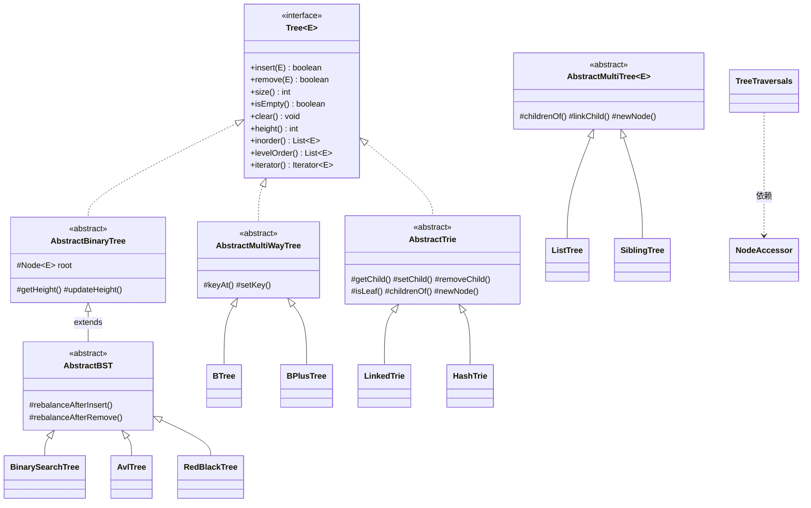

# 统一树结构公共抽象层 — `com.ds.tree.common`

本项目最初有 9 棵独立实现的树(二叉排序树、AVL、红黑、B 树、B+ 树、字典树、多叉树),彼此大量重复:先/中/后/层序遍历、中序迭代器、`printTree`、`size/height/findMin/findMax` 各写一份。本包把整个树族整合成 **"公共抽象层 + 各树继承"**。

**核心洞察(也是整个设计的第一原则):** 不是把全部树塞进一个类——那是"上帝对象"。而是按 **孩子结构** 分成几族,公共算法**只写一次**,差异(平衡策略 / 子节点存储 / 分裂合并)留在子类。孩子结构就是天然的抽象边界:

- 左右两指针 → 二叉树族
- `keys[] + children[]` 数组 → 多路树族(B 树)
- 字符编码下标 / Map → 字典树族
- 任意个孩子的 List / 兄弟链表 → 多叉树族

---

## 一、架构总览(类图)

```
Tree<E>  接口 —— 有序集合树的最小公共契约(增删/统计/高度/中序/层序/迭代)
│   implements
├─────────────┬─────────────────┬──────────────────┐
│             │                 │                  │
AbstractBinaryTree      AbstractMultiWayTree       AbstractTrie
│  (left/right 两指针)   │  (keys[]/children[])    │ (字符下标/Map 子节点)
│             │                 │                  │
AbstractBST             BTree<E>                 LinkedTrie
│  (BST 增删+平衡钩子)   BPlusTree<E>             HashTrie
├─────────────┼─────
BinarySearchTree  AvlTree  RedBlackTree
（零逻辑）       （覆盖平衡钩子）（覆盖增删+颜色）

────────────────────────────────────────────────────────
Iterable<E>  独立分支 —— 结构树(无排序、无 inorder,故不入 Tree 接口)
│
AbstractMultiTree<E>
│  (三个存储原语:childrenOf/linkChild/newNode)
├──────────────┐
ListTree<E>    SiblingTree<E>
(List 孩子)    (左孩子右兄弟链)

────────────────────────────────────────────────────────
TreeTraversals —— 遍历算法工具类(递归/栈/Morris),与节点结构解耦,
                  经 NodeAccessor 可作用于任意二叉树节点
```

Mermaid 版本(支持 GitHub / IDE 渲染):



---

## 二、四类树分支与抽象边界

| 分支 | 抽象基类 | 孩子结构 | 覆盖的树 | 是否实现 `Tree<E>` |
|---|---|---|---|---|
| 二叉树族 | `AbstractBinaryTree` + `AbstractBST` | `left` / `right` 两指针 | BST、AVL、红黑 | ✅ |
| 多路树族 | `AbstractMultiWayTree` | `keys[] + children[]` 数组 | B 树、B+ 树 | ✅ |
| 字典树族 | `AbstractTrie` | 字符编码下标 / `Map<Character,Node>` | LinkedTrie、HashTrie | ✅(以 `String` 为元素) |
| 多叉树族 | `AbstractMultiTree` | 任意个孩子(List / 兄弟链) | ListTree、SiblingTree | ❌(无序结构树,无 inorder) |

**统一节点是有代价的**——这是"整合到哪一层"的边界证据:

- `AbstractBinaryTree.Node` 带 `height`(AVL 用)与 `color`(红黑用)字段,普通 BST 两者都不用;
- `AbstractMultiWayTree.Node` 带 `next`(B+ 树叶子链表)字段,B 树忽略;
- `AbstractTrie` 用六个存储原语让 LinkedTrie/HashTrie 共享全部逻辑;
- **`ArrayTrie`(二维数组编号存储,无对象节点)、多叉树(无序)不在此抽象内** —— 正如 B 树不在二叉树抽象内。

---

## 三、各树取舍

| 树 | 增/删/查复杂度 | 特点 | 适用场景 | 代价 / 局限 |
|---|---|---|---|---|
| `BinarySearchTree` | O(h),最坏 O(n) | 最简单,无平衡 | 数据接近随机、教学 | 有序插入退化成链(height=n) |
| `AvlTree` | O(log n) 严格最坏 | 高度差 ≤ 1,查找常数最小 | 读多写少、需要严格最坏保证 | 每个节点多一个 height 字段 |
| `RedBlackTree` | O(log n) 分摊 | 平衡约束松(黑高平衡),写路径更少旋转 | 写读均衡(JDK `TreeMap` 同款) | 每个节点多一个 color 字段 |
| `BTree` | O(log_t n) | 单节点多键,磁盘页友好 | 数据库 / 文件系统索引 | 节点数组内存固定 |
| `BPlusTree` | O(log_t n),范围 O(log n+k) | 数据全在叶子 + 叶子链表,范围查询强 | 数据库索引(范围扫描) | 内部分隔键冗余(真数据在叶子) |
| `LinkedTrie` | O(单词长度) | 数组子节点,按编码定位 O(1) | 字符集小且固定(如 ASCII) | 每个节点占 range 大小空间 |
| `HashTrie` | O(单词长度) | `Map` 子节点,只分配实际分支 | 任意字符(中文/Emoji) | HashMap 常数开销略高 |
| `ListTree` | 构建为主 | `List` 孩子,直观、随机访问 | 组织结构 / 目录树 / JSON 树 | — |
| `SiblingTree` | 构建为主 | 左孩子右兄弟,链表省空间 | 转二叉树、紧凑存储 | 兄弟链查找 O(孩子数) |

**复杂度速查(二叉有序树):** 平均/最优 O(log n);BST 最坏 O(n),AVL 与红黑最坏 O(log n)。

---

## 四、复用收益对照表

> 行数含注释与类头;原实现**全部未改动**(git 确认零已跟踪文件被修改),公共层为全新代码。

| 树 | 原实现(旧) | 公共层新实现 | 子类自写 | 复用的公共算法 |
|---|---|---|---|---|
| 二叉排序树 | `BinarySortedTree` **509** | `BinarySearchTree` **17** | 0 行逻辑 | `AbstractBinaryTree`+`AbstractBST` 共 568 |
| AVL | `BalancedBinaryTree` **597** | `AvlTree` **127** | 平衡钩子 + 旋转 | 同上 |
| 红黑树 | `RedBlackBST` **992** | `RedBlackTree` **217** | LLRB 增删 + 颜色维护 | 同上 |
| B 树 | `BTree` **589** | `BTree` **322** | 分裂 / 合并 / 旋转 | `AbstractMultiWayTree` 303 |
| B+ 树 | `BPlusTree` **1102** | `BPlusTree` **578** | 分隔键 + 叶子链表 | 同上 |
| 字典树(数组) | `LinkedTrie` **332** | `LinkedTrie` **105** | 6 个存储原语 | `AbstractTrie` 375 |
| 字典树(Map) | `HashTrie` **313** | `HashTrie` **71** | 6 个存储原语 | 同上 |
| 多叉树(列表) | `Tree` **155** | `ListTree` **53** | 3 个存储原语 | `AbstractMultiTree` 330 |
| 多叉树(兄弟链) | 旧实现无 | `SiblingTree` **73** | 3 个存储原语 | 同上 |

**额外复用:**

- `Tree` 接口 **60** 行 — 统一四类"集合树"的最小契约;
- `TreeTraversals` **243** 行 — 把原先分散在 `BinaryTree` / `MorrisTraversal` / `ThreadedBinaryTree` 的遍历算法(递归 / 栈 / Morris)统一收口,经 `NodeAccessor` 与节点结构解耦;
- **公共节点状态字段**(height/color/next)是"统一层"带来的内存代价,换来的是每种树只写自己的差异部分。

---

## 五、测试覆盖(8 个测试类,70 个用例,全部通过)

| 测试类 | 用例数 | 覆盖重点 |
|---|---|---|
| `BinarySearchTreeTest` | 11 | 增删查、四种遍历、迭代器、边界 |
| `AvlTreeTest` | 6 | 平衡因子、升序插入高度 O(log n)、与 BST 对比 |
| `RedBlackTreeTest` | 6 | 红黑五性质(根黑/无红红/黑高相等)、随机增删后仍合法 |
| `TreeTraversalsTest` | 6 | 递归/栈/Morris 三者一致、Morris 后树未被破坏 |
| `BTreeTest` | 8 | 分裂插入、合并删除、结构不变量、与 `TreeSet` 对拍 |
| `BPlusTreeTest` | 12 | 叶子链表、分隔键==右子树最小键、范围查询、与 B 树对拍 |
| `AbstractTrieTest` | 11 | 计数语义、前缀统计、分支剪除、两存储实现对拍 |
| `AbstractMultiTreeTest` | 10 | 先/后/层序、两种孩子表示对拍、兄弟链结构 |

> 复跑现有 `com.ds.btree.BTreeTest` / `BPlusTreeTest` 共 **123 用例**同样通过,证明公共层(如给 `AbstractMultiWayTree.Node` 加 `next` 字段)不破坏原有实现。整个项目测试仅 3 个失败,全部位于 `edu.princeton.cs.algs4`(跳表/队列),为**预先存在**、与树无关。

---

## 六、如何扩展:新增一棵树

1. **判断孩子结构**,选对抽象基类:
   - 左右两指针 → `AbstractBinaryTree`(排序语义则进一步继承 `AbstractBST`);
   - `keys[] + children[]` 数组 → `AbstractMultiWayTree`;
   - 字符序列 / 前缀 → `AbstractTrie`(实现 6 个存储原语);
   - 任意个孩子的结构树 → `AbstractMultiTree`(实现 3 个存储原语)。
2. **继承基类**,实现差异点:
   - 平衡策略覆盖钩子:AVL 覆盖 `rebalanceAfterInsert/Remove`;
   - 需在递归路径上就地维护的(红黑颜色),整体覆盖 `insert/remove`;
   - 语义与基类默认不符的方法(如 B+ 树的 `inorder` 只输出叶子键)直接 `@Override`。
3. **补测试**:参照同族测试类(双实现双跑、随机对拍 `TreeSet`、结构不变量校验)。
4. **不破坏原代码**:新类放本包即可,原实现保持不动。

---

## 七、已知取舍与语义差异

- **`Tree<E>.insert` 对 Trie 的语义差异**:重复单词 `insert` 返回 `false`(未新增)但**仍累计计数**——这是 Trie 允许重复插入的本质特性,与其他树"insert 失败不改树"不同。
- **`Tree<E>.inorder` 对 B+ 树**:被覆盖为只输出叶子真键(内部分隔键是拷贝,若输出会重复)。
- **`ArrayTrie`(二维数组编号)、线索树 / Morris(遍历算法而非独立树)、`RedBlackBST`(符号表 K-V)**:不在本公共层的直接继承体系内,但 `TreeTraversals` 可为其复用遍历算法。

---

*本包由 `com.ds.tree.common` 全量源码 + 8 个 JUnit5 测试类构成,新增代码共 3,442 行,对比原实现 5,013 行。*
